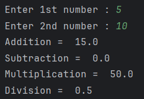

# Simple Calculator Program

This Python program performs basic arithmetic operations such as addition, subtraction, multiplication, and division on two input numbers. The program prompts the user to enter two numbers and then outputs the results of these operations.

## Features : 
* **Addition** : Adds two numbers.
* **Subtraction** : Subtracts the second number from the first.
* **Multiplication** : Multiplies the two numbers.
* **Division** : Divides the first number by the second.

## Usage : 
1. Clone or download this repository.
2. Open the Python file in your favorite code editor or IDE.
3. Run the Python file.
4. The program will prompt you to enter two numbers:  
Enter 1st number: The first number to perform arithmetic operations on.  
Enter 2nd number: The second number to perform arithmetic operations on.
5. The program will then display the following results:  
Addition  
Subtraction   
Multiplication   
Division of the first number by the second (if valid).

## Sample output : 
