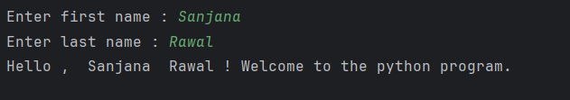

# Welcome user program

This Python program takes a user's first and last name as input and greets them with a personalized message. It's a simple introduction to Python's input() and print() functions.

## Features : 

* **First Name Input** : Takes the user's first name as input.
* **Last Name Input** : Takes the user's last name as input.
* **Personalized Greeting** : Combines both names , concatenates and displays a greeting message.

## Usage :
1. Clone or download this repository.
2. Open the Python file in your preferred code editor or IDE.
3. Run the Python file.
4. The program will prompt you to enter:  
First Name: Your first name.  
Last Name: Your last name.
5. The program will display a greeting message, combining your first and last name.

## Sample Output : 
