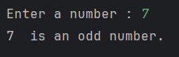
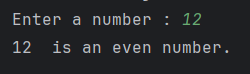

# Even-Odd Checker 
This Python script checks whether a given number is even or odd. It takes an integer input from the user and outputs whether the number is even or odd.

## Features
* **User Input** : The script allows the user to input any integer.
* **Even or Odd Check** : It checks if the input number is even or odd.

## Usage : 
1. Clone or download this repository.
2. Open the Python file in your favorite code editor or IDE.
3. Run the Python file.
4. The program will prompt you to enter a number. 
5. The program will then display that whether the number is even or odd

## Sample outputs : 

