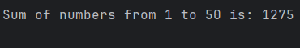

# Sum of numbers from 1 to 50
This Python script calculates the sum of all integers between a given range (start=1 to stop=51 as mentioned in given task) by using a simple loop.

## Code Breakdown
1. **Initialization:**
   * sum = 0: This initializes the variable sum to 0, which will hold the total.
   * start = 1: The starting number of the range.
   * stop = 51: The ending number of the range (51 is excluded, so the loop will stop at 50).
2. **Loop:**
   * The for loop iterates through each number in the range from start to stop - 1. In this case, it will loop from 1 to 50.
3. **Summing the Numbers:**
   * sum += i: This adds the current number i to the sum variable during each iteration.
4. Output:
   * After the loop finishes, the final value of sum is printed to the console.

## Sample output : 

## Usage : 
1. Clone or download this repository.
2. Open the Python file in your favorite code editor or IDE.
3. Run the Python file.