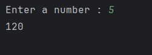

# Factorial Calculator 
The python script calculates factorial of a non negative number provided by user.

#### What does a factorial mean?
0! = 1   
1! = 1 * 0! = 1   
2! = 2 * 1! = 2    
3! = 3 * 2! = 6   
4! = 4 * 3! = 24  
and so on , n! = n * (n-1)!    
It means , factorial of a number n is it's product with all the numbers smaller then it and greater then 0 

## Features : 
* The program prompts the user to enter a number and then calculates its factorial using a recursive function.
* If the user enters a non-negative integer, it prints the factorial.
* If the user enters a negative number, it prints an error message.

## Usage : 
1. Clone or download this repository/file.
2. Open the Python file in your favorite code editor or IDE.
3. Run the Python file.
4. The program will prompt you to enter a number.
5. After number is prompted , it will display that number's factorial value.

## Sample Output : 
