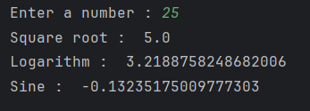

# Math module for calculation
The script  takes an integer input from the user and calculates it's square root , natural logarithm (log base e) and sine of the number ( in radians)

## Features
* Uses Python's built-in math module
* Accepts user input from the console
* Displays results for:
   * Square root
   * Natural log (base e)
   * Sine value (in radians)
  
## Usage : 
1. Clone or download this repository/file.
2. Open the Python file in your favorite code editor or IDE.
3. Run the Python file.
4. The program will prompt you to enter a number.
5. After number is prompted , it will display value of square root , natural log , sine (in radians) of that number.

## Sample Output : 
