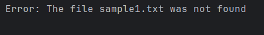
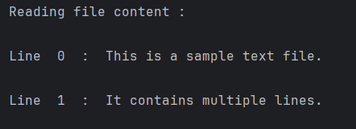

# File reader
This simple Python script reads all lines from "sample.txt" text file and prints them line by line with their line numbers.

##  Description
The script attempts to open a file named sample.txt in read mode. If the file exists, it reads all lines and prints each one with its line index. If the file does not exist, it catches the FileNotFoundError and prints a user-friendly error message.

## Sample Output 
* ### If file not found : 

* ### If file is present at desired location : 
