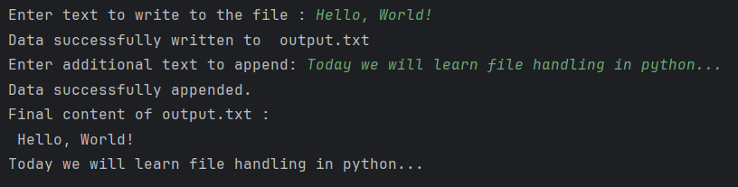

# File handling 

This simple Python script shows basic file handling operations like writing, appending, and reading from a text file. It interacts with the user through the command line to collect input and perform the operations accordingly.

## Description
* Creates a file named output.txt (or overwrites it if it already exists).
* Writes user-input text to the file.
* Appends additional user-input text to the same file.
* Reads and displays the final content of the file.

## Sample output : 
