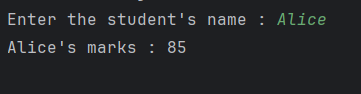
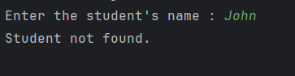

# Finding student marks
This Python script allows users to look up the marks of a student by entering their name.

## Features 
* Stores marks of students in a dictionary.
* Takes user input for a student's name.
* Displays the corresponding marks if the student exists.
* Informs the user if the student's name is not found.

## Sample outputs 
* #### If student's name is found :

* #### If student's name is not found : 
