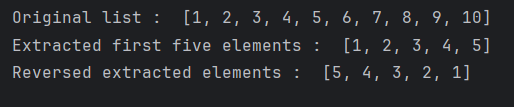

# List Slicing Demonstration
This script demonstrates how to use list slicing in Python to extract and reverse specific elements from a list.

## Features :
* List comprehension - Quickly generates a list of numbers from 1 to 10.
* List slicing: [start:stop:step] - Demonstrates how to extract a portion of a list using Python slicing syntax
* Reverse slicing with negative step - Shows how to reverse a part of a list using a negative step.

## Sample output
